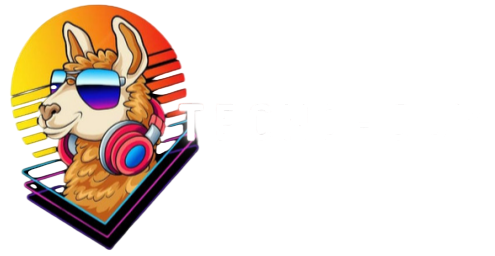

# TECNO - JUY

## Descripción del Proyecto

TECNO - JUY es un comercio electrónico ubicado en Jujuy que se especializa en la venta de productos de tecnología. Ofrecemos una amplia gama de productos tecnológicos, incluyendo PC gamers, notebooks, periféricos, sillas gamer y más. Nuestro objetivo es proporcionar a nuestros clientes acceso fácil y conveniente a productos de calidad que mejoren su experiencia tecnológica.

## Oferta de Productos/Servicios

En TECNO - JUY, ofrecemos una variedad de productos y servicios relacionados con la tecnología, incluyendo:

- PC gamers: Equipos y componentes de alta calidad para construir la configuración perfecta para los gamers.
- Notebooks: Dispositivos portátiles potentes y confiables para el trabajo y el entretenimiento en movimiento.
- Periféricos: Teclados, ratones, auriculares y otros accesorios para mejorar la experiencia de uso.
- Sillas gamer: Sillas ergonómicas y confortables diseñadas para brindar comodidad durante largas sesiones de juego o trabajo.

## Audiencia Objetivo

TECNO - JUY está dirigido a entusiastas de la tecnología, gamers y cualquier persona interesada en adquirir productos tecnológicos de calidad en la provincia de Jujuy. Nuestra audiencia objetivo incluye:

- Gamers y entusiastas de la tecnología que buscan componentes de alta calidad para sus configuraciones de PC.
- Estudiantes y profesionales que necesitan notebooks y dispositivos electrónicos confiables para su trabajo o estudios.
- Personas en busca de periféricos y accesorios tecnológicos que mejoren su experiencia de uso.
- Aquellos que desean adquirir sillas gamer ergonómicas y confortables para largas sesiones de juego o trabajo.

## Equipo

Nuestro equipo está compuesto por 8 alumnos del curso de Full Stack Web Developer de Digital House. Cada uno aporta sus conocimientos y habilidades al proyecto:

- Lucas ([lepzito](https://github.com/lepzito)): En constante aprendizaje en el mundo de la programación. Soy originario de Abra Pampa, provincia de Jujuy.
- Mauro: Hola Soy estudiante de Digital House nacido en San Salvador De Jujuy.
- Lujan: Estudio contador público en la UNJU FCE, estoy aprendiendo programación y sobre como diseñar.

- Samuel: Descripcion
- Brian: (Ema) estudiante de Digital House, pendiente a un proyecto.Soy de San Salvador De Jujuy.
- Miguel: Descripcion.
- Daniel: Descripcion.

## Sitios de Inspiración para Nuestro E-commerce

1. [ArmyTech](https://ArmyTech.com.ar/) - De aqui tomamos ideas para el login y register.
2. [Venex](https://www.venex.com.ar/)-De aqui para el carrito de compras.
3. [ADIDAS](https://www.adidas.com/) - De la pagina de Adidas nos gusto la parte de **foorter_newsletter**, creemos que es una formas atractiva de hacer que los clientes se registren en nuestro sitio web y obtengan un 10%de descuento en la primer compra, ademas tambien la parte del **header** ya que lo consideramos visualmente estetico.
4. [Fullh4rd](https://www.fullh4rd.com.ar)
5. [Compra Gamer](https://www.compragamer.com/) - de CompraGamer nos parecio una buena idea copiar su parte del main la extructura en si es simple y atractiva, tambien la parte del footer.
6. [Mercado_Libre](https://www.mercadolibre.com/) - de MercadoLibre nos gusto la parte de la descripcion del producto, describe al detalle el producto y esta bien extructurado para que sea comodo para el usuario.

¡Gracias por visitar TECNO - JUY!

## Link de Tablero de TRELLO

https://trello.com/b/QPep3s7h/sprint-1

## Solo admins

/products/admin
para levantar el servidor
npm test
en la raiz del proyecto
